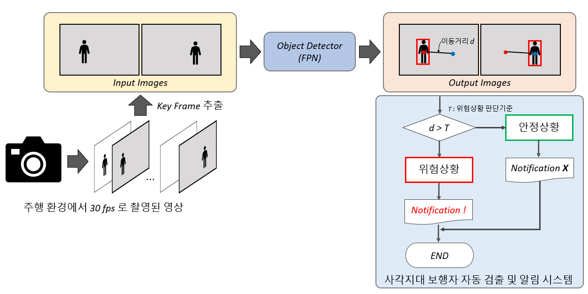
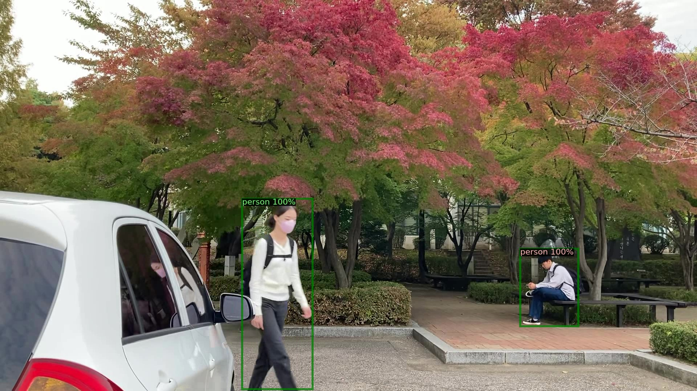
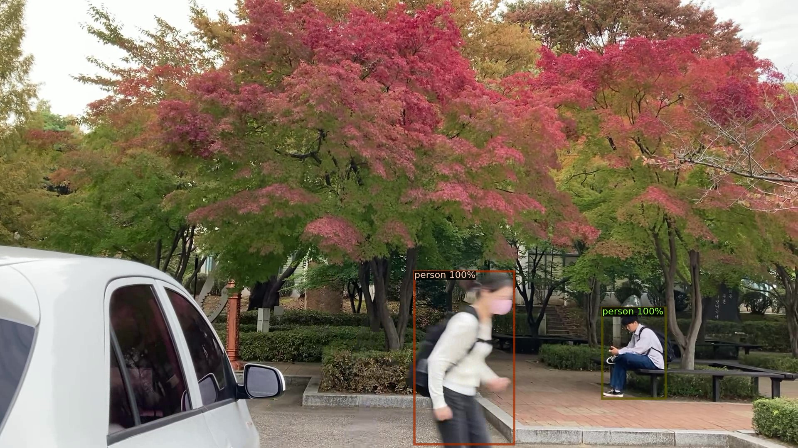

# 딥러닝을 활용한 영상기반의 보행자 검출 및 사각지대 위험상황 자동 알림 기술
### Automatic Notifiaction of Dangerous Situations in Blind Spots via Image-based Pedestrian Detection using Deep Learning
### KHU 2022-2학기 캡스톤디자인2
------------------------
## Abstract

최근 자율주행 기술이 빠르게 발전하였지만, 여전히 사각지대의 보행자에 대해 대처하는 방안에 대한 연구는 부족하다. 기존에는 사각지대에 있는 보행자를 인식하고 운전자에게 사고가 발생할 가능성이 있는 위험상황을 알려주기 위하여 다양한 센서를 활용하여 왔지만 비용이 많이 들거나 보행자 인식에 대한 정확도의 문제점이 있다. 본 프로젝트에서는 자율주행 환경에서 카메라에서 촬영되는 영상 정보만으로 사각지대의 보행자를 검출 및 움직임 상태를 파악하여, 사고가 발생할 가능성이 있는 상황으로 판단이 되면 운전자에게 자동으로 알려주는 기술을 소개한다. 제안하는 방법은 영상 정보만을 이용하기 때문에 비용적인면에서도 우수하며, 운전자에게 위험요소를 자동으로 알려주어 사고가 발생할 가능성을 줄인다는 측면에서 실제 자율주행 자동차에 널리 적용될 수 있는 유용한 기술로 판단된다.

## About the Project
본 프로젝트에서는 카메라 영상 센서만을 활용하여 자율주행 환경에서 자동차 사각지대의 보행자 검출 및 자동으로 운전자에게 위험한 상황을 알려줄 수 있는 기술을 제안하고자 한다. 해당 기술은 상대적으로 비용이 저렴한 카메라 센서를 활용하는 장점이 있고, 영상 정보를 활용하여 보행자를 효과적으로 검출 및 자동으로 알림을 해준다는 면에서 실제 자율주행 자동차에로다방면으로 적용이 될 수 있는 유용한 기술로 판단된다.

## Related Study
### 1. FPN(Feature Pyramid Network)  
single-scale 이미지를 convolutional network에 입력하여 다양한 scale의 feature map을 출력하는 네트워크.   관심영역을 기반으로 다양한 크기의 객체에 집중.

### 2. RetinaNet  
Focal Loss 성능을 구현하기 위해 개발된 네트워크로서 PRN에서 나온 Anchor box 개념과 SSD, FPN에서 나온 feature pyramids 개념을 이용함. 
### 3. DETR  
DETR은 크게 3가지 요소로 구성되어 있다. Feature representation을 추출하기 위한 CNN backbone, transformer의 encoder-decoder 구조, Feed forward network(FFN)으로 이루어져 있음. Transformer의 특성상 학습하는데 굉장히 많은 시간을 요하게 되고 small object 탐지력이 약함.

## Installation

See [installation instructions.](https://detectron2.readthedocs.io/en/latest/tutorials/install.html)

## Getting Started
See [Getting Started with Detectron2](https://detectron2.readthedocs.io/en/latest/tutorials/getting_started.html), and the [Colab Notebook](https://colab.research.google.com/drive/16jcaJoc6bCFAQ96jDe2HwtXj7BMD_-m5) to learn about basic usage.  
Learn more at our [documentation](https://detectron2.readthedocs.io/en/latest/). And see [projects/](https://github.com/facebookresearch/detectron2/tree/main/projects) for some projects that are built on top of detectron2.

## License
Detectron2 is released under the [Apache 2.0 license. (https://github.com/facebookresearch/detectron2/blob/main/LICENSE)

## Flowchart

## Proposed Method
제안하는 방법은 근거리의 사각지대의 객체의 위험을 판단하는 것이 주목적이므로, 객체가 멀리 위치해 있어서 관심영역에 해당하지 않는 객체까지 검출되는 것을
막기 위해 다음과 같이 2가지 조건을 두었다.  
첫 번째 조건은 객체 검출결과의 중심점의 y좌표가 화면의 절반
하단 부에 위치해 있을 때만 검출하도록 한다.  
두 번째 조건은 검출된 객체가 검출결과의 bounding-box 넓이가
500 미만일 때, 검출하지 않도록 한다.  
이 때, 본 논문에서는 제안한 방법이 위험상태로 판단
한 것을 시각화하기 위해, 위험상태로 판단한 경우에 보
행자 검출결과(bounding-box)를 빨간색으로 시각화하고,
안전상태로 판단한 경우에 검출결과를 초록색으로 시각
화 하였다.

## Results

 

GREEN bounding box means "Safe"

 

  

RED bounding box means "Dangerous"

## Reference
1. https://github.com/facebookresearch/detectron2
2. T.-Y. Lin, P. Dollar, et al.,“Feature pyramid networks for object detection,” in IEEE Conf. Comput. Vis. Pattern Recognit. (CVPR), 2017, pp. 2117–2125.
3. A. Geiger, P. Lenz, and R. Urtasun, “Are we ready for Autonomous Driving? The KITTI Vision Benchmark Suite,”in Proc. Conf. Comput. Vis. Pattern Recognit. (CVPR), 2012, pp. 3354-3361.
## Contacts
박규리
kyuri0924@khu.ac.kr
